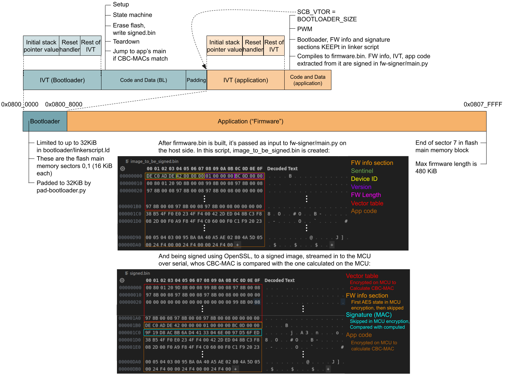

## Goal
Bare-metal programming the Cortex-M4 core on the STM32F446RE MCU, leveraging libopencm3, we’ll implement AES encryption and compute a CBC-MAC based on custom code that runs immediately after the MCU resets. We’ll implement a “loading” mechanism that will allow us to send data over serial connection from a host machine to the target, and have the MCU accept it only if the CBC-MAC passed matches the one computed on the target using a symmetric secret key.  

This process can be thought of as a small scale, not production-suitable, analogy of a real life case where we have a chip on a PCB with a USB port. We tell the user they can plug it in and run some piece of code, possibly even from a web browser, which serves as an authenticated firmware update mechanism.  

> ⚠️ NOTE: Any 3rd party who wants to get involved with this mechanism, will be able to do it quite easily, as long as they’re able to dump the device’s flash. The secret, symmetric key lies there, which is a major disadvantage of the implementation, and it  illustrates the risk of storing secrets in plaintext on insecure hardware. This would make the device practically open for anyone who dumped the secret key to sign their code and run it on the device.  While not secure or production-ready, the project demonstrates the concept of verifying firmware integrity using symmetric cryptography.  
<br>

### Outline
Building up to the goal described above, several components were written and tested:  
1. **Application firmware**  
"A custom C program that utilizes a Timer peripheral to configure a PWM signal which changes the brightness of an on-board LED. This is referred to as the “application”, “main application”, “firmware” or “fw”, analogous to a real life product’s functionality  
2. **UART Driver**  
A basic UART driver on the MCU for communication with a host PC over serial.  
3. **Ring buffer**  
A lightweight implementation of a ring buffer that stores data transmitted to the MCU over UART from the host PC  
4. **Packet protocol**  
Designing a custom packet protocol and implementing it to standardize the communication between the host and the target. This serves as a basic example of a synchronized communication scheme, such as those involving framing, acknowledgment, and command-response patterns.  
5. **Bootloader**  
A C program that serves as the target machine side of the application code “loading”  mechanism. Loading as in transferring over serial to flash, and initiating execution. This is referred to as the “Bootloader”, though it has nothing to do with the pre-programmed piece of code within the MCU’s ROM or any of its boot pins. It acts as a user defined first stage boot loader. If the CBC-MAC of the transferred data checks out fine, execution is redirected to the main application. Else, the core resets  
<br>

### Build and run
```bash
cd bootloader
make
cd ../app
make
cd ..
$ python fw-signer/main.py app/firmware.bin 0x00000001   # argv[2] is version number in hex
```
Run bootloader.elf on the target machine using the debugger tool of choice such as ST-Link or J-Link. It’ll enter a while loop, waiting to receive messages over UART. Send the signed firmware by running the host side TypeScript script:
```bash
$ ts-node fw-updater signed.bin
```
Expected output:
```
[.] Reading the firmware image...
[$] Read firmware image (3516 bytes)
[.] Attempting to sync with the bootloader
Sending SYNC_SEQ: <Buffer c4 55 7e 10>
[$] Synced!
[.] Requesting firmware update
[$] Firmware update request accepted
[.] Waiting for device ID request
[$] Device ID request recieved
[.] Responding with device ID 0x42
[.] Waiting for firmware length request
[$] Firmware length request recieved
[.] Responding with firmware length
[.] Waiting for a few seconds for main application to be erased...
[.] Waiting for a few seconds for main application to be erased... (waited 1 sec)
[.] Waiting for a few seconds for main application to be erased... (waited 2 sec)
...
[.] Wrote 16 bytes (16/3516)
[.] Wrote 16 bytes (32/3516)
...
[.] Wrote 12 bytes (3516/3516)
[$] Firmware update complete!
```

